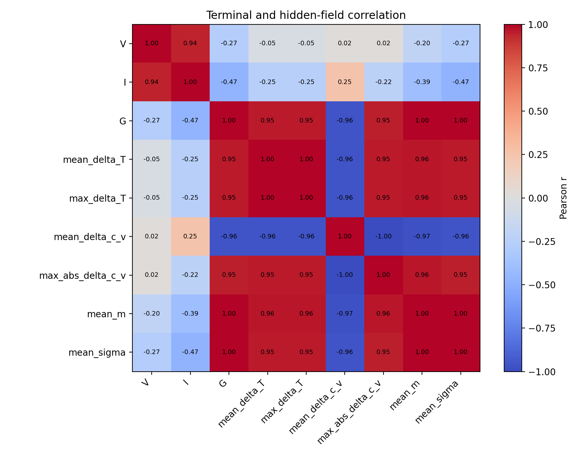
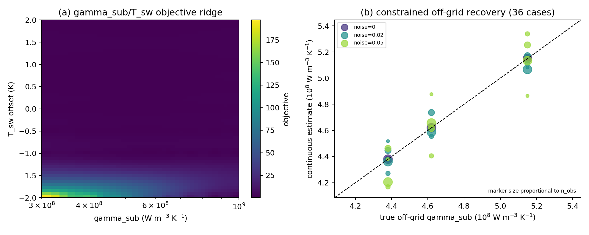
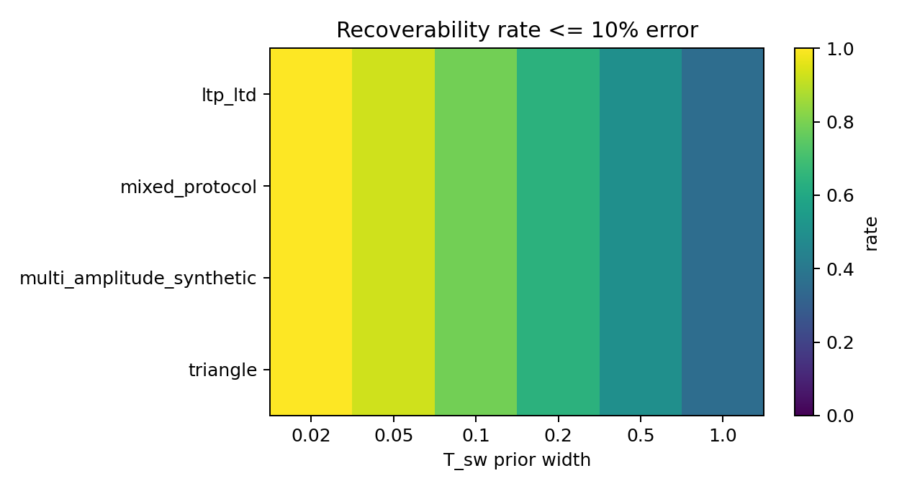
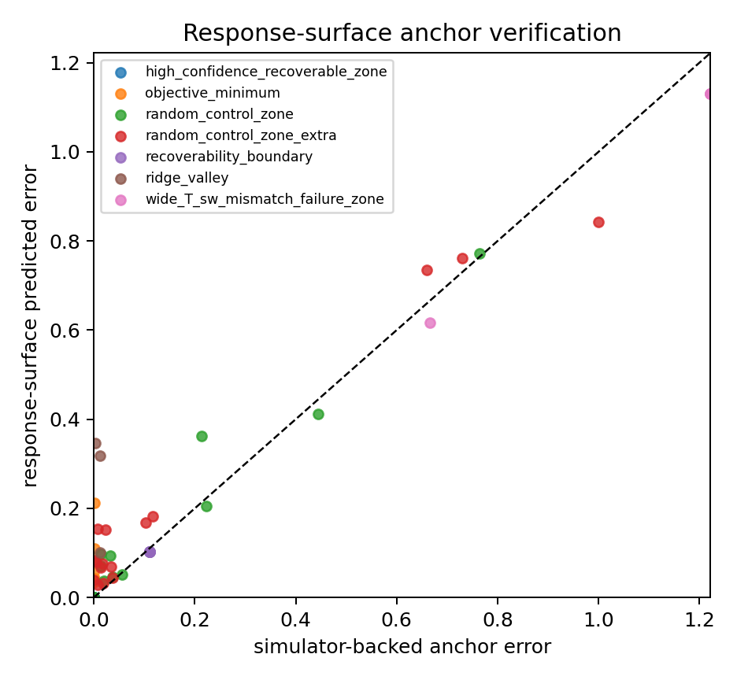
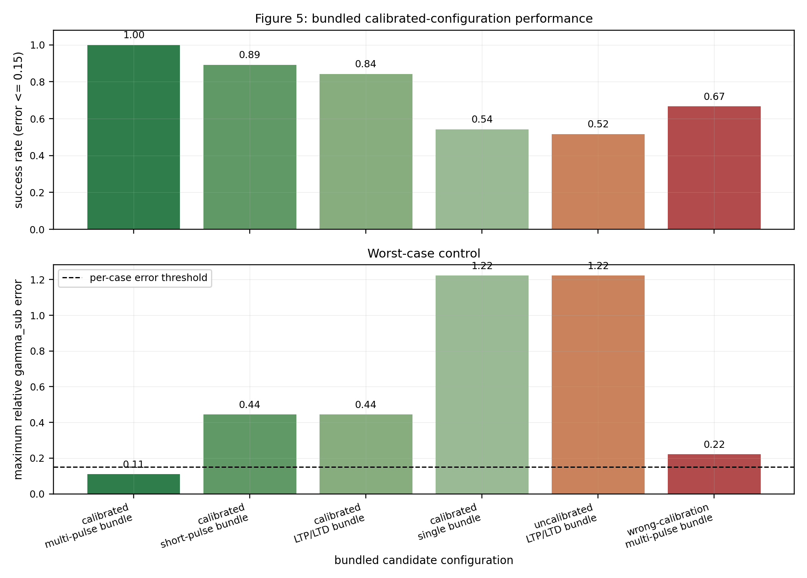
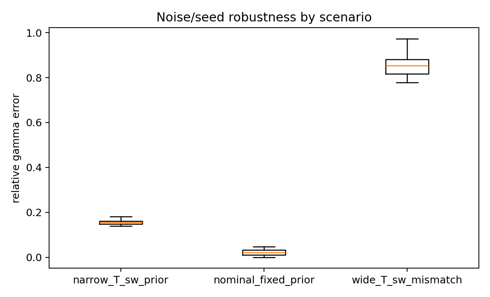

# Calibration-gated inference of an effective heat-loss coordinate from sparse terminal observations in a synthetic phase-change-device benchmark

## Abstract

Sparse terminal measurements do not generally determine every internal field
and material parameter of a phase-transition device. We study this limitation
in a frozen one-dimensional synthetic numerical digital twin that couples
electrical conduction, defect evolution, Joule heating, phase state, boundary
and interface conditions, and terminal current. A full physics-informed neural
formulation was implemented as an attempted inverse route, but bounded training
did not jointly satisfy terminal, field, residual, interface, and conservation
gates. We therefore use identifiability screening to reduce the inverse target
to the effective substrate heat-loss coordinate
\(\gamma_{\mathrm{sub}}\). Terminal conductance is strongly associated with
integrated conductivity, yet port-only recovery of the complete configured
hidden fields fails. With microphysics fixed and switching temperature
\(T_{\mathrm{sw}}\) calibrated or tightly bounded, continuous off-grid,
noise, observation-count, and simulator-backed audits support conditional
recovery of \(\gamma_{\mathrm{sub}}\). A calibration--protocol
disentanglement audit shows that calibration supplies nearly all of the tested
gain; protocol variation is a secondary robustness modifier. Wider
\(T_{\mathrm{sw}}\) mismatch produces a reproducible refusal region. The
result is not an experimental device identification or unrestricted
full-field inversion. It is a fail-closed synthetic benchmark demonstrating
that the observation operator, nuisance calibration, and independent-solver
checks must gate the physical quantity reported by a sparse-data digital twin.

**Keywords:** inverse problem; phase-transition device; digital twin;
identifiability; calibration; heat dissipation

## 1. Introduction

Phase-transition and oxide memristive devices couple conduction, Joule
heating, material state, defect transport, and heat rejection. Voltage and
current are inexpensive to measure, whereas internal temperature, conductive
state, and defect fields are difficult to observe directly. The inverse map is
therefore many-to-one unless the measurement protocol or physical priors add
sufficient information. A small terminal error alone cannot establish unique
parameter recovery, correct hidden fields, or conservation.

Physics-informed neural networks (PINNs) combine data with differential
equation residuals [@raissi2019; @karniadakis2021]. They can restrict an inverse
solution space, but they do not create information absent from the observation
operator. This distinction is particularly important near a phase transition,
where sharp constitutive gradients, strongly coupled nuisance parameters, and
unequal residual scales can make optimization difficult while several internal
states remain observationally confounded.

Here we treat identifiability as a prerequisite rather than an outcome assumed
from model expressivity. The study uses a versioned and frozen synthetic
one-dimensional benchmark; no measured device data enter any positive result.
We first audit what sparse terminal observations constrain and retain the
failed complete-hidden-field and full-neural routes as evidence boundaries. We
then reduce the target to a single effective heat-loss coordinate and test it
under off-grid truth values, noise, observation counts, nuisance mismatch, and
fresh simulator-backed anchors.

The study makes two primary contributions and one conditional contribution.
First, it establishes a configured practical recoverability and ambiguity
boundary: sparse terminal data strongly constrain an integrated conductivity
response but do not recover the complete configured hidden fields. Second, it
shows that switching-temperature calibration gates conditional recovery of
the effective coordinate \(\gamma_{\mathrm{sub}}\) under the stated synthetic
model, parameter ranges, and protocols. Third, a factorial decomposition
conditionally supports a narrower conclusion: in the tested bundle,
calibration dominates the gain and protocol variation provides only a
secondary refinement. These are benchmark-specific numerical findings, not a
universal identifiability theorem, laboratory calibration specification, or
experimental validation.

## 2. Synthetic benchmark and inverse contract

### 2.1 Frozen numerical digital twin

Ground Truth v1.1 is a literature-guided synthetic numerical benchmark. Its
configuration, arrays, acceptance report, and manifest are hash-locked. The
historical device inspiration is an oxide multilayer stack, but the evidence
in this paper is generated by the declared reduced one-dimensional equations
and must not be interpreted as a fabricated-device result.

The state is \((\phi,c_v,T,m)\), where \(\phi\) is electrical potential,
\(c_v\) is a normalized defect coordinate, \(T\) is temperature, and \(m\)
is a conductive-state coordinate. Conductivity is a white-box closure
\(\sigma(c_v,T,m)\). For the one-dimensional series discretization,

\[
R_A(t)=\sum_i\frac{\Delta x_i}{\sigma_i(t)},\qquad
J(t)=\frac{V_{\mathrm{app}}(t)}{R_A(t)},\qquad
I(t)=A_{\mathrm{eff}}J(t).
\]

The sparse observation operator contains terminal voltage, current, and
conductance. Hidden fields are never supplied to a port-only inverse and are
used only for synthetic scoring or explicitly labeled field-anchor controls.
The thermal balance includes

\[
\rho C_p\,\partial_tT=-\partial_xq_T+JE-
\gamma_{\mathrm{sub}}(T-T_0),
\]

so \(\gamma_{\mathrm{sub}}\) is the benchmark's effective distributed heat-loss
coordinate. It aggregates the reduced model's heat rejection and is not
claimed to be a directly transferable bulk substrate constant.

Two excitation families are retained from the frozen benchmark: a triangular
voltage protocol that resolves a terminal hysteresis trajectory and an LTP/LTD-
like pulse sequence that samples state accumulation and relaxation. The
observation-count audit subsamples their terminal traces without changing the
underlying simulated trajectory. Noise is applied to each declared observable
with a seeded protocol and every noisy target is re-inverted. Clean targets are
not reused as substitutes for noisy inversions.

The benchmark separates three roles that are sometimes conflated. Ground truth
defines the synthetic data-generating process; the inverse simulator evaluates
candidate parameters; and the observation operator exposes only the declared
terminal quantities. A response surface or neural output is never used as its
own independent judge. This separation allows a low port error, a correct
parameter estimate, and a correct hidden-field trajectory to be scored as
different propositions.

### 2.2 Attempted complete physics-informed inverse

The full neural formulation predicts the declared state variables, derives
conductivity, and evaluates electrical, defect-transport, thermal, and
state-evolution residuals together with initial, boundary, interface, terminal,
and global-ledger constraints. An independent simulator, not a network output,
judges the evidence. Success requires simultaneous terminal, hidden-field,
held-out residual, interface-flux, and conservation gates. Operator and
manufactured-solution checks establish that the implemented differential
operators can be evaluated; they do not count as successful trained solutions.

Every bounded trained route evaluated for this study misses at least one
blocking gate. Consequently, no positive claim is based on a trained complete
PINN. This failure motivates target reduction; it does not prove that every
possible architecture or training budget must fail.

### 2.3 Identifiability screening and target reduction

We audit terminal-to-state correlations and port-only ablations before
releasing inverse parameters. Because multiple field configurations can map to
similar terminal conductance, failure of complete-field recovery reduces the
inverse target to \(\gamma_{\mathrm{sub}}\), while microphysical coordinates
are fixed and \(T_{\mathrm{sw}}\) is either fixed or tightly bounded.

The locked reduced objective is

\[
\mathcal J(\gamma_{mathrm{sub}})=
\operatorname{rRMSE}(\widehat G,G)^2+
0.5\operatorname{rRMSE}(\widehat I,I)^2+0.01\mathcal R_H,
\]

where \(\mathcal R_H\) is the declared heat-balance regularizer. Candidate
profiles are evaluated with the independent reduced simulator. Discrete
screening is followed by continuous refinement so that accuracy is not defined
only at preselected grid points.

For continuous refinement, the best coarse candidate defines a neighboring
bracket. A bounded scalar minimization is then performed in
\(\log\gamma_{\mathrm{sub}}\), and the simulator is re-executed at every trial
coordinate. The off-grid truths are excluded from the candidate set, and the
audit checks that each refined solution includes non-grid simulator calls.
Thus the reported refinement is neither candidate lookup nor interpolation of
the objective profile.

### 2.4 Confounding, calibration, and protocol audits

The nuisance audit evaluates the joint objective over
\((\gamma_{\mathrm{sub}},T_{\mathrm{sw}})\). A dense response surface contains
2501 interpolated points constructed from 77 simulator-backed points; it is
therefore a visualization and screening aid, not 2501 independent numerical
solves. Selected fresh solver anchors test its local fidelity.

Recoverability is assessed over predeclared noise, observation-count, prior,
and protocol conditions. A separate 1350-case calibration-tolerance sweep is
checked by a 270-case ODE-backed spot audit. The displayed 0.1 K marker is a
configured synthetic threshold under the declared error criterion, not an
experimental instrument requirement.

The phase-diagram sweep contains 2688 configured response-surface cases. Its
purpose is to map success and refusal regions efficiently; it is not assigned
the evidential weight of 2688 direct simulations. A 60-anchor comparison
therefore records both classification agreement and discrepancy, including
boundary disagreements. The manuscript retains this qualification rather than
using the dense sweep as an independent-solver census.

To separate calibration and waveform effects, a factorial audit decomposes the
total change into calibration, protocol, and interaction terms. This prevents a
bundled result from being described as isolated protocol gain. All missing,
non-finite, upstream-ineligible, or threshold-failing cases fail closed.

### 2.5 Evaluation and claim statuses

Relative errors are computed against nonzero synthetic truth values. Success
rates count all preregistered conditions rather than discarding failed seeds or
nuisance settings. Claim status is restricted to `supported`,
`qualified_supported`, `failed_but_informative`, or `forbidden`. A
`qualified_supported` result is valid only under its stated synthetic model,
priors, ranges, and observations.

All lightweight evidence tables are versioned with stable schemas. The frozen
inputs and protected historical results are checked by SHA-256 before and after
the audit chain. Main figures are linked to their exact source tables through a
byte-level manifest. This provides traceability from claim sentence to table
and figure without representing a source-table hash as physical validation.

## 3. Results

### 3.1 Sparse ports constrain an integrated response, not the complete fields

Terminal conductance and mean conductivity have correlation 0.9999966 in the
configured data, but port-only ablations do not recover the complete
temperature, defect, phase, and conductivity fields (Figure 1). This contrast
is the practical ambiguity boundary: a terminal trace may be accurate while
the internal decomposition remains wrong.

The complete neural routes reinforce this distinction. The initial bounded
training has port NRMSE 0.123764, above the 0.10 gate, and all four normalized
residual RMS values exceed 0.01. An instrumented replay improves the port NRMSE
to 0.0955475 but retains substantial thermal, phase, interface, and global
ledger errors. A mixed state--flux variant improves selected terms but still
fails the joint contract. These are retained as
`failed_but_informative`; they cannot support trained-solver or full-field
claims.

### 3.2 Calibration gates the reduced inverse

With nuisance coordinates fixed at their nominal values, the profile minimum
returns \(\widehat\gamma_{\mathrm{sub}}=4.5\times10^8\) for a truth of
\(4.5\times10^8\). The 36-case continuous off-grid audit covers noise levels
0%, 2%, and 5% and observation counts 8, 16, 32, and 64; the maximum refined
relative error is 0.05565. Figure 2 shows both the
\((\gamma_{\mathrm{sub}},T_{\mathrm{sw}})\) ridge and the off-grid estimates.

A 42-case confounding audit identifies \(T_{\mathrm{sw}}\) as the dominant
tested nuisance coordinate. The recoverability phase diagram retains both
calibrated success and wide-prior failure regions (Figure 3). The 270-case
simulator-backed spot audit supports the configured response-surface transition
near the 0.1 K calibration-error marker. Median relative error is 0.1111 at
0.04 K and 0.1 K, and 0.2222 at 0.2 K under that audit. This is a numerical
threshold for this benchmark and criterion only.

Across the 2688 screening cases, 70.24% satisfy the 0.10 relative-error
criterion and 80.95% satisfy the 0.20 criterion. These aggregate rates are not
used to erase the failed blocks: the best screened protocol is LTP/LTD-like,
the worst is triangular, and wide nuisance mismatch remains outside the
qualified region. In the 42-case direct confounding audit, 27 cases are within
0.10 and 32 within 0.20; the worst tested case has relative error 1.2222.

Selected fresh simulator evaluations agree sufficiently with the response
surface for its declared screening role (Figure 4). They do not convert the
dense interpolation grid into independent ODE evidence.

Specifically, the 60-anchor audit gives classification agreement 0.8833, mean
absolute discrepancy 0.05374, and maximum discrepancy 0.34299. The maximum and
the boundary disagreements are why the response surface remains a qualified
mapping tool rather than a replacement for direct simulator evidence.

### 3.3 Calibration dominates protocol in the tested bundle

The calibrated sequential configuration passes its declared gate in 720
synthetic simulator-backed cases (Figure 5). However, waveform/duration and
calibration-error factors vary together in that bundle. The separate factorial
audit attributes 1.12167 of the 1.13811 total gain to calibration, 0.01496 to
protocol, and 0.00148 to interaction. Thus protocol variation is a secondary
robustness refinement rather than the primary source of recoverability.

Seeded noise audits retain the calibrated-prior success region and the failed
wide-\(T_{\mathrm{sw}}\)-mismatch region (Figure 6). In a broader 2400-case
stress audit, the best tested calibrated short-pulse sequence has success rate
0.9604 but worst-case relative error 0.4444. That stress result is reported in
the Supplementary Information and is not promoted to an unqualified main
result.

The statistical robustness audit contains 480 cases across 10 seeds. Reporting
the complete block structure is essential: conditional success under calibrated
priors and failure under broad mismatch coexist. A global mean would obscure
the refusal region and would therefore be insufficient for claim promotion.

## 4. Discussion

The central finding is that calibration and observability determine what the
inverse may report. The terminal operator is highly informative for an
integrated conductivity response, yet insufficient for the complete configured
hidden fields. Reducing the target and controlling the dominant nuisance
coordinate converts an ill-supported high-dimensional question into a
conditionally supported one-dimensional estimate.

This interpretation differs from treating physics regularization as a remedy
for all non-uniqueness. Differential-equation residuals restrict admissible
solutions, but the failed full-neural audits show that architectural
completeness and terminal agreement are not substitutes for held-out residual,
interface, field, and conservation evidence. The independent simulator and
fail-closed gates prevent a neural or interpolated output from judging itself.

The calibration--protocol decomposition is also important. Without it, the
720-case bundle could be misread as evidence that waveform choice creates the
recoverability gain. Instead, calibration dominates in the tested design;
protocol contributes a smaller conditional improvement. This result motivates
future experimental-design studies, but does not establish protocol optimality.

The benchmark is deliberately reduced. Its value lies in exposing a traceable
inverse boundary under controlled truth, not in reproducing every geometric,
microstructural, or contact effect of a device. Extension to spatially resolved
two- or three-dimensional models would increase the number of confounded
fields and would require additional observables or stronger priors before an
inverse claim could be made.

The results also suggest a practical experimental-design hierarchy. Improving
the calibration of the dominant nuisance coordinate is more valuable, within
the tested range, than adding waveform complexity while leaving that nuisance
uncertain. Only after calibration reduces the objective ridge does protocol
variation become a meaningful secondary design variable. This hierarchy is a
testable design implication, not an assertion that the selected protocol is
optimal for a physical device.

Finally, negative evidence carries methodological information. The failed
complete-neural routes identify which numerical contracts are not yet
satisfied; the wide-prior cases identify where an estimate should be refused;
and the source-contract audit distinguishes a traceable analytic identity from
unavailable author implementation details. Preserving these outcomes reduces
the risk that numerical flexibility is mistaken for physical information.

## 5. Limitations

1. All positive evidence is synthetic and one-dimensional. No project-generated
   or independent measured device data are used.
2. \(\gamma_{\mathrm{sub}}\) is an effective coordinate of the declared
   reduced model, not an independently measured substrate constant.
3. Recovery is conditional on fixed microphysics and calibrated or tightly
   bounded \(T_{\mathrm{sw}}\); unconditional identifiability is not claimed.
4. No trained complete-PINN route passes the joint terminal, field, residual,
   interface, and conservation gates.
5. The public VO\(_2\) source contract [@qiu2024] does not provide executable
   author code or all reversal-event details; the repository's analytic
   tanh-anchor inverse is source-traceable but is not claimed to reproduce
   unavailable author intent or code.
6. The 0.1 K marker is a configured synthetic-audit threshold, not a laboratory
   specification.
7. Full hidden-field recovery, terminal-only two-dimensional inversion,
   universal Fourier/F-SPS superiority, full STL-PINN reproduction,
   device-grade FEM/3D reproduction, and real experimental validation remain
   outside the evidence.

## 6. Conclusion

Sparse terminal observations support an inverse claim only when the requested
coordinate is compatible with the observation and calibration contract. In
the frozen synthetic benchmark, complete hidden-field recovery fails, whereas
switching-temperature calibration enables conditional recovery of the
effective heat-loss coordinate \(\gamma_{\mathrm{sub}}\). Calibration, not
protocol variation, supplies nearly all of the measured gain in the tested
factorial audit. The resulting workflow is fail closed: audit ambiguity,
reduce the target, calibrate the dominant confounder, verify with an independent
simulator, and retain failed regions rather than generalizing past them.

## Data and code availability

The code, configurations, tests, lightweight numerical tables, committed
figures, and claim maps needed to audit the manuscript are versioned in the
project repository. Frozen binary benchmark arrays and third-party publisher
PDFs are local assets and are not redistributed in the repository. The
benchmark asset pack can be made available on reasonable request where license
and repository policy permit. The exact boundary and replay instructions are
given in the accompanying data and reproducibility statements.

## Author contributions (CRediT)

**Conceptualization:** [AUTHOR]. **Methodology:** [AUTHOR]. **Software:**
[AUTHOR]. **Validation:** [AUTHOR]. **Formal analysis:** [AUTHOR].
**Investigation:** [AUTHOR]. **Data curation:** [AUTHOR]. **Visualization:**
[AUTHOR]. **Writing -- original draft:** [AUTHOR]. **Writing -- review and
editing:** [AUTHOR]. **Supervision:** [AUTHOR].

## Funding

[FUNDING INFORMATION TO BE COMPLETED BEFORE SUBMISSION.]

## Competing interests

[COMPETING-INTEREST DECLARATION TO BE COMPLETED BEFORE SUBMISSION.]

## Use of generative AI

[JOURNAL-SPECIFIC AI-ASSISTANCE DISCLOSURE TO BE COMPLETED AND VERIFIED BY ALL AUTHORS BEFORE SUBMISSION.]
